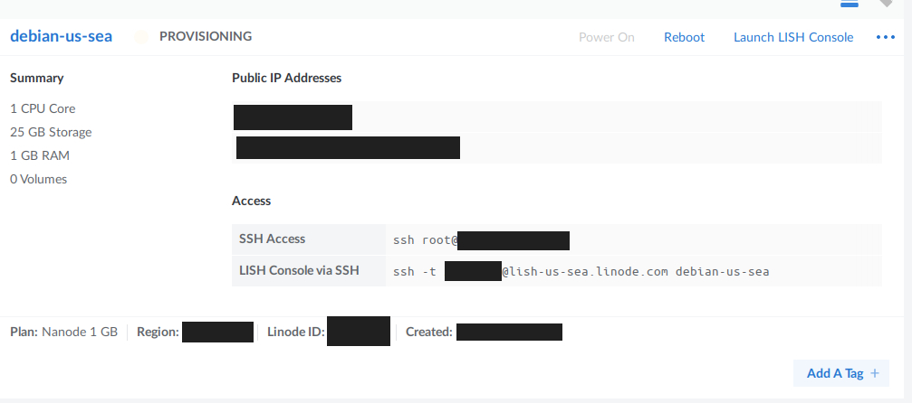
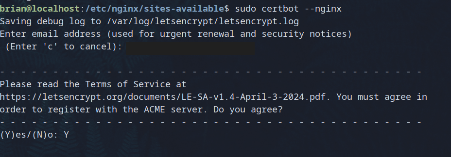

## How To Set Up A Linode/Akamai VPS With NGINX An Docker

### Introduction

This extensive tutorial will cover the essentials necessary to set up a Linode
Shared CPU Instance (aka a Virtual Private Server or VPS), implementing basic
security features on said instance, as well as installing and setting up a
NGINX HTTP server, and utilizing that as a reverse proxy for a virtualized
Docker Container which will host a running React Application. We will also be
demonstrating how to "point" our Linode instance to the Domain Name Registry,
NameCheap, and utilizing Certbot via NGINX to establish SSL certificates via
LetsEncrypt.

### Prior Knowledge That's Nice To Have

This tutorial is meant for those who are curious on how things "work under the
hood". Setting up your own Virtual Private Server does <em>not</em> give you as
much control as hosting a Physical Server at your own home, but gives you far
more control over what you can and cannot host on services like Heroku and
Netlify. These services are helpful in their own right, but in utilizing them
you miss out on learning basic System Administration Skills that are covered
within this tutorial.

While not required, it is good to have at least a passing familiarity with a
UNIX-like shell environment, like bash or zsh, commonly found on Linux and MacOS
systems respectively. Additionally, understanding the basics of virtualized container
applications like Docker is good to know prior to embarking on tackling what is covered
in this tutorial, and will be extremely helpful in comprehending what is happening.
That said, it is not necessary that you have aforementioned knowledge in order to
implement what is covered. Ultimately, this is simply a lengthy set of instructions.

### What We Won't Cover

This tutorial series will not cover System Administration Skills in depth, only
the basics to get a web server up and running will be covered. Additionally,
signing up for Linode and NameCheap will be generally glossed over, as that
is a simple task of purchasing Domain Names and a Virtual Private Server
Instance.

### Setting Up A Linode/Akamai VPS

After signing up with Linode/Akamai, you should be presented with a dashboard
screen that looks like this:


As you can see, we already have a Linode server running, but if this is your
first time spinning up a VPS, this section will be blank. Let's click on the
button that says <b>Create Linode</b>.

Once you have done so, the dashboard will navigate you to a set up page:


There is a lot of options here, and we'll be utilizing only a basic plan. Of
interest firstly is the <b>Choose a Distribution</b> dropdown. This gives you
options of which Linux Distribution we wish to run on our VPS. We'll actually be
leaving the default <b>Debian 11</b>, but there are many fine options each with
their own pros and cons available. Debian is considered a very stable
distribution with minimal maintenance requirements, so we'll be choosing this
for our example. Others that I might recommend include <b>Ubuntu</b> or <b>Alma
Linux</b>.

Next, we'll need to specify a <b>Region</b>, this field indicates which
Geographical Location you wish your VPS to be hosted on. The two factors to
consider when making this choice is the proximity of said server to your
geographic location, and also the proxmity of said server to the geographic
location of any who might utilize the services you host on this VPS. For these
demonstration purposes, I'll be choosing one physically closest to me.

Lastly, we have the Linode Plan. You can think of this as simply purchasing a
sort of "Rental" space on the web, where you can rent something akin to a small
apartment, a house, or a mansion depending on your needs. We'll be going with
the cheapest plan available, which is under the <b>Shared CPU</b> option,
picking the <b>Nanode</b> VPS. This provides us with 1GB of RAM, 1 CPU Core,
25 GB of SSD storage, as well as a reasonable Network speed.


Scrolling down, we now have further details necessary before we can create our
Linode. Under the <b>Details</b> section, we'll find a <b>Linode Label</b>
section, which will simply establish a name we can reference our VPS instance on
the Linode dashboard, the default for ours thus far is <b>debian-us-sea</b>, but
you can name it whatever you'd like.

Next we have to establish a Root Password. Proper password generation is somewhat
outside of the scope of this tutorial, but it's my advice to generate a pretty robust
password for your VPS in particular, as hacking VPS instances is a <em>very</em>
common occurence. My rule of thumb is to generate a 32 character password that
is at least a 3 word phrase, including uppercase/lowercase letters, and at least
1 number, and 1 symbol, changing said password every 3 months.

Lastly we have establishing an SSH key. While SSH key generation may be somewhat
outside the scope of this article, I feel it's important to cover the essentials
on how to do so. This will assume you use a UNIX-like operating system, as the
steps for establishing SSH keys are somewhat different on the Windows OS.


**Setting Up SSH Keys**

This section is heavily taken from [Linode's Official Docs](https://www.linode.com/docs/guides/use-public-key-authentication-with-ssh/?tabs=ed25519-recommended%2Cmanually%2Cssh-add) on the subject, and establishing SSH keys within the context of a VPS is important, so I highly recommend you go into more depth even after following these instructions, as there is far more to it than what is covered here.

Firstly, from the command line, establish an SSH key using the following
command:

```sh
ssh-keygen -t ed25519 -C "user@domain.tld"
```

The `ed25519` is the encryption algorithm we are using and the string
`"user@domain.tld"` should be replaced with your actual email address. This will
open up a basic CLI prompt asking you to name the file where both your public
and private SSH keys will be established. <em>Note</em> that if you have
established SSH keys in the past (like on Github), that you could potentially
<em>overwrite</em> your previous ssh key if you use the same name as before, so
be sure to establish a unique filename here (navigate to your `~/.ssh` directory
before completing this process and double check if you are not sure).

Afterwards you'll be asked to establish a password that will be input every time
you use ssh to login to your Linode server. The same conventions for establishing
a secure password I mentioned above apply here.

Navigate to your `~/.ssh` directory and find the filename you established, it
should be `filename.pub`, or if you left it blank it will simply be `id_ed25519.pub`. `ssh-keygen` creates both a public and private key that are utilized to create a secure shell link between computers. <b>NEVER</b> let your private key out into the wild on the internet, the <b>public</b> key is, as its name suggests, meant to be shared publicly with whichever server you establish a connection with. This is denoted by the `.pub` extension to avoid confusion. Copy the text content of your `id_ed25519.pub` or `filename.pub` file and paste it into the <b>Add SSH Key</b> menu under the <b>SSH Public Key</b> field.


After doing so, you should see a list of your establish SSH keys on the Linode
dashboard menu.

While there are other configuration options that are worthwhile to explore, this
tutorial series is about establishing the basics, so this is where we will leave
the configuration, and sign up.

After establishing this new Linode VPS, you can return to the main dashboard,
where you'll notice that the Linode will take a bit of time to provision
the resources and boot up your new VPS computer.



Once done, it should show a green dot and the text <b>Running</b> to indicate
that the VPS is ready to be logged into.


To the right hand side, you'll notice the <b>Access</b> section, which shows
command line instructions on how to use `ssh` to securely log into our vps.
Let's do that now:

```shell
ssh root@000.000.000.000
```

You will now be asked for the password you established during the `ssh-keygen`
process. Enter this password and you should be presented with a new UNIX shell.


### Securing Our New VPS

Now that we have created a CLI interface to our new VPS, we'll need to do some
basics to secure it. The topic of security is vast, and this will only establish
some very basic best practices when securing a VPS. First is setting up a
firewall, second setting up a new user with `sudo privileges so we cannot ssh in
as the root user, and third is securing ssh login attempts via a configuring the
ssh program, as well as utilizing a popular security package called fail2ban.

**Update Debian:**

Firstly though, we'll want to update our system so that we can ensure it has the
latest security updates:

```sh
apt update && apt upgrade
```

I'll not bother showing a screenshot here, as this is pretty standard Linux
stuff. After confirming that you'll agree to the additional disk space being
taken up by the update, the `apt` package manager will update your system. In
order to ensure that the update takes proper effect, we'll have to reboot
our system:

```sh
reboot
```

Note that this will kick you out of your `ssh` session, as the VPS instance is
indeed rebooting. This will take a few minutes, so make sure to wait before
attempting to ssh in again from your home machine.

You can monitor when exactly the VPS will come back up online via the Linode
dashboard:


Once you see the VPS's green color and <b>Running</b> text return, you're ready
to ssh and login to your shell again.

**Setting Up a Firewall:**

Let's now set up a firewall using a classic package called `ufw`
(Uncomplicated FireWall). We're going to block all traffic except for ports 22,
80, and 443. These are the default ports are for ssh, http, and https respectively.

```sh
apt install ufw
```

We'll need to use a terminal text editor to ensure ufw allows IPv6 connections,
use either Debian's built in editor `vim` or `nano` to ensure the IPV6 flag
is turned to `yes`. I'll be using `vim`, but newcomers will most likely be more
comfortable using `nano`.

```sh
vim /etc/default/ufw
```

And look for the `IPV6` flag, and change it to `yes` if it isn't already
configured as such.

We'll now set `ufw` defaults to deny allow incoming traffic, and allow all
outgoing traffic. Don't worry, we'll not leave these as defaults.

```sh
ufw default deny incoming && ufw default allow outgoing
```

You'll see some output that looks like this:

```
Default incoming policy changed to 'deny'
(be sure to update your rules accordingly)
Default outgoing policy changed to 'allow'
(be sure to update your rules accordingly)
```

Let's now allow the ports we mentioned earlier:

```shell
ufw allow 22 && ufw allow 80 && ufw allow 443
```

Finally let's enable ufw:

```shell
ufw enable
```

You may encounter a message that warns you it might disrupt the ssh connection,
as long as you allowed access via port 22, you will remain connected. Go
ahead and hit `y` to this message.

If all went well you should receive this message:

```
Firewall is active and enabled on system startup
```

Let's now check to be sure ufw is running properly:

```sh
ufw status
```

Which should now provide us with this message:

```
Status: active

To                         Action      From
--                         ------      ----
22                         ALLOW       Anywhere
80                         ALLOW       Anywhere
443                        ALLOW       Anywhere
22/tcp                     ALLOW       Anywhere
22 (v6)                    ALLOW       Anywhere (v6)
80 (v6)                    ALLOW       Anywhere (v6)
443 (v6)                   ALLOW       Anywhere (v6)
22/tcp (v6)                ALLOW       Anywhere (v6)
```

Right now, these are the only ports we'll need in order to run our server. This
is mainly achieved because we are using Docker. If we were installing other
services that needed access on different ports, like a PostgreSQL database
(which uses port 5432 by default), then we'd need to tell UFW to allow those
ports as well.

**Establishing a Sudo User:**

We've been running our server as `root` thus far, but this is bad practice. The
`root` user is capable of doing anything on our server, including completely
destroying our filesystem and other malicious things. Should our server ever get
compromised, it's best that they not be able to gain "root access" when they
somehow managed to ssh into our server. We'll establish what is known as a
"superuser", create a new unique password that is different from our previously
established VPS and ssh passwords, and give them what is known as `sudo` access,
which allows them to temporarily act as root.

First, we'll use the `adduser` command to establish a new user named `brian`:

```sh
adduser brian
```

Which will produced the following output:

```
Adding user `brian' ...
Adding new group `brian' (1000) ...
Adding new user `brian' (1000) with group `brian' ...
Creating home directory `/home/brian' ...
Copying files from `/etc/skel' ...
New password:
```

After entering and confirming your new password, you'll see output prompts like
so:

```
New password:
Retype new password:
passwd: password updated successfully
Changing the user information for brian
Enter the new value, or press ENTER for the default
        Full Name []:
        Room Number []:
        Work Phone []:
        Home Phone []:
        Other []:
Is the information correct? [Y/n] y
```

Next we'll be adding brian to the `sudo` group using the `usermod` command:

```sh
usermod -aG sudo brian
```

To confirm that `brian` was added to the `sudo` group, we'll use the `getent`
command:

```sh
getent group sudo
```

Which will look like this output if we did everything correctly thus far:

```
sudo:x:27:brian
```

Next we'll need to configure `sudo` to grant all permissions to `brian` using
the `visudo` command like so:

```sh
sudo visudo
```

This will open up the `nano` text editor, under the line that says `# User
privilege specification`, type in the following, which will essentially grant
`brian` super user privileges whenever they enter the established sudo password
correctly:

```
# User privilege specification
brian ALL=(ALL:ALL) ALL
```

Now let's use the `su` command to change from being `root` to `brian`:

```sh
su  - brian
```

You should see your shell prompt change, but just to be sure enter the `whoami`
command preceded by the `sudo` command:

```sh
sudo whoami
```

This will show the default sudo message (which is only shown upon first
invocation of sudo by the user):

```
brian@localhost:~$ sudo whoami

We trust you have received the usual lecture from the local System
Administrator. It usually boils down to these three things:

    #1) Respect the privacy of others.
    #2) Think before you type.
    #3) With great power comes great responsibility.

[sudo] password for brian:
root
```

**A Warning:**

Notice that after entering our password, that the `whoami` command returns the
output `root`. This is because `sudo` essentially changes the entity of whoever
invoked the command to `root`. This makes `sudo` especially powerful. For
example invoking the following:

```sh
# NOTE!!: DO NOT INVOKE THIS COMMAND!!!!!
sudo rm -rf --no-preserve-root /*
```

Will completely remove all filesystems on our Linux computer and we will have
deleted everything, destroying this Linode Server and forcing us to start over
from scratch.

**Preventing Root SSH Login:**

We'll now configure SSH to be more secure, one of the first things we're going
to do is only allow our new user `brian` to log in via ssh. Although `brian` has
`sudo` privileges, we established a different password for him than our login
password (right??), thusly even if a potential hacker managed to hack our Linode
server, he'd still have to guess the `sudo` password in order to do <b>real</b>
damage (note: our supposed hacker could still access and potentially destroy any
files belonging to brian though).

Let's use either `nano` or `vim` to edit our `/etc/ssh/sshd_config` file. Note
that we'll have to now use `sudo` to access this file while logged in as
`brian`, as all files under `/etc` are owned by `root`:

```sh
sudo nano /etc/ssh/sshd_config
```

Look for the line with the field `PermitRootLogin` and change it from
`yes` to `no`.

We'll now use Debian's native init system, systemd, to restart the ssh service
so that these new rules are enforced:

```sh
sudo systemctl restart sshd
```

Let's now exit our shell session and ssh back in as root, which should fail:

```sh
ssh root@000.000.000.000
```

The following Output demonstrates that our new ssh rules are in place, no matter
how often we input the correct password for root, it denies us access:

```
Enter passphrase for key '/home/brian/.ssh/id_ed25519':
root@000.000.000.000's password:
Permission denied, please try again.
root@000.000.000.000's password:
Permission denied, please try again.
root@000.000.000.000's password:
root@000.000.000.000: Permission denied (publickey,password).
```

Now let's log in as `brian`:

```sh
ssh brian@000.000.000.000
```

When prompted for the password, make sure here to use the password
established for `brian` when we created him as a user earlier.

**Further Security Via Fail2Ban:**

Once logged back in, we'll continue to secure our VPS using the popular package
`fail2ban`. This package is specifically for use with `ssh` and will essentially
prevent malicious actors from making multiple repeated login attempts over a certain
amount of time. First let's install it using `apt`:

```sh
sudo apt install fail2ban
```

We'll now need to configure fail2ban. In order to ensure we don't accidentally break
fail2ban, we'll copy the configuration file first so we have a backup should we
do anything wrong:

```sh
sudo cp /etc/fail2ban/jail.conf /etc/fail2ban/jail.local.conf
```

This will allow us to edit the official fail2ban.conf file without fear of
messing up. Open up the fail2ban.conf file using `vim` or `nano`.

```sh
sudo nano /etc/fail2ban/jail.conf
```

We'll now change the default settings, which are rather restrictive, so that
anyone attempting to log into our VPS will be banned for 10 minutes, if they
entered the wrong password 3 times within the last 20 minutes. Change the
following fields within the /etc/fail2ban/jail.conf file to the following:

```
bantime = 600
findtime = 1200
maxretry = 3
```

We'll now use systemd's systemctl command to enable our newly configured
fail2ban service:

```sh
sudo systemctl enable --now fail2ban
```

For the sake of expediency, we will not test this, but do keep in mind that
should you fail to log in 3 times in a row within 20 minutes on your VPS from
now on, that you will be locked out of your VPS for 10 minutes until you will be
allowed to make another 3 attempts again.

### Conclusions On Security

While I know we haven't even gotten to setting up our application via Docker and
NGINX yet, it is important that we first secure our VPS in this manner. There
actually is much more you can do to secure your VPS (like shutting off password
login, forcing ssh only login), but this is the bare minimum, and will give you
at least some basic security on your VPS. Attempts to ssh into VPS login shells
are <em>extremely common</em>, so it's good to make sure to set up your VPS properly.

### Setting Up NGINX

NGINX is an HTTP protocol web server commonly used for load balancing, reverse
proxying, and sometimes serving just basic HTML files. We'll start off slow by
simply installing NGINX and seeing if we can see their default HTML page by
visiting our VPS's IP Address in a Web Browser.

First, let's use `apt` to install NGINX:

```sh
sudo apt install nginx
```

Use systemd's `systemctl` command to ensure that the NGINX service is running:

```sh
systemctl status nginx
```

As long as the status is showing that NGINX is running, you actually can test to
see a default HTML page on the live internet, though you'll need to turn off
HTTPS only in your browser to see it.

From a web browser, enter your VPS's ip address into your web browser. Be sure
to precede it using `http://` as we'll be using the old HTTP protocol to test
it:

```
http://000.000.000.000
```

You should see NGINX's default page:


Great, but obviously we'd like to do more than just view the default web page.
Let's now use NGINX as a reverse proxy for a virtualized docker container
running a ReactJS application:

### Using NGINX to Reverse Proxy A Docker Container

Installing Docker on Debian is not as straight forward as some other Linux
distributions, but is well worth it and we only have to do it once. We'll first
need to install some required dependencies:

```sh
sudo apt install apt-transport-https ca-certificates curl gnupg2 software-properties-common
```

To authenticate with docker via debian, we'll need to add Docker's GPG key using
`curl` and `gpg`:

```sh
curl -fsSL https://download.docker.com/linux/debian/gpg | sudo gpg --dearmor -o /etc/apt/trusted.gpg.d/docker-archive-keyring.gpg
```

We'll then need to configure our package manager, `apt` to utilize this gpg key
to authenticate with docker's repositories:

```sh
echo "deb [arch=amd64 signed-by=/etc/apt/trusted.gpg.d/docker-archive-keyring.gpg] https://download.docker.com/linux/debian $(lsb_release -cs) stable" | sudo tee /etc/apt/sources.list.d/docker.list > /dev/null
```

And to ensure that apt is configured with these new configurations, we'll need
to run `apt update` again:

```sh
sudo apt update
```

Now we can install docker using apt:

```sh
sudo apt install docker-ce docker-ce-cli containerd.io
```

We can now test if docker is working properly:

```sh
sudo docker run hello-world
```

Which, if all has gone well, should produce the following output:

```
Unable to find image 'hello-world:latest' locally
latest: Pulling from library/hello-world
c1ec31eb5944: Pull complete
Digest: sha256:a26bff933ddc26d5cdf7faa98b4ae1e3ec20c4985e6f87ac0973052224d24302
Status: Downloaded newer image for hello-world:latest

Hello from Docker!
This message shows that your installation appears to be working correctly.

To generate this message, Docker took the following steps:
 1. The Docker client contacted the Docker daemon.
 2. The Docker daemon pulled the "hello-world" image from the Docker Hub.
    (amd64)
 3. The Docker daemon created a new container from that image which runs the
    executable that produces the output you are currently reading.
 4. The Docker daemon streamed that output to the Docker client, which sent it
    to your terminal.

To try something more ambitious, you can run an Ubuntu container with:
 $ docker run -it ubuntu bash

Share images, automate workflows, and more with a free Docker ID:
 https://hub.docker.com/

For more examples and ideas, visit:
 https://docs.docker.com/get-started/
```

We'll also want to tell our init system, systemd, to start docker on boot:

```sh
sudo systemctl enable docker
```

For the sake of convenienc,e let's also allow our user, `brian`, to invoke the
`docker` command, as right now `root` is the only user allowed to utilize
`docker`. We'll do this in a similar manner as when we gave `brian` `sudo`
access, by adding `brian` to the `docker` group (which was established upon
installation) like so:

```sh
sudo usermod -aG docker ${USER}
```

To ensure docker is running properly, check with systemctl:

```sh
sudo systemctl status docker
```

### Running a ReactJS Application In Docker

We're now going to run a ReactJS application inside of Docker. Funny enough this
Docker Container will also use NGINX inside of it to serve the final build of
the ReactJS application. We'll then use the NGINX service running on our Linode
VPS to reverse proxy the ReactJS application out onto the world wide web.

First we'll need to pull in our ReactJS Application. While we could use `git` to
do this if our application code is available on a public repository on Github or
the like, we can also showcase another fantastic command to copy files directly
from our home machine to our Linode VPS. Use the `scp` command to copy the files
directly from your home machine to the Linode VPS like so:

/home/brian/sandbox/getrandomfont-react-docker

```sh
scp -r /home/brian/sandbox/getrandomfont-react-docker brian@000.000.000.000:/home/brian/
```

This will recursively copy the `getrandomfont-react-docker` directory into the
home directory of our user `brian` on our Linode VPS.

Indeed, the output shows the files being copied over ssh in real time:

```
docker-compose.yml                                                              100%  121     6.0KB/s   00:00
README.md                                                                       100% 3359   235.4KB/s   00:00
Dockerfile                                                                      100%  147    10.6KB/s   00:00
index.html                                                                      100% 1721    98.9KB/s   00:00
robots.txt                                                                      100%   67     3.6KB/s   00:00
manifest.json                                                                   100%  492    25.4KB/s   00:00
logo192.png                                                                     100% 5347   356.8KB/s   00:00
logo512.png                                                                     100% 9664   543.8KB/s   00:00
favicon.ico                                                                     100% 3870   106.7KB/s   00:00
package-lock.json                                                               100%  702KB   3.9MB/s   00:00
index.html                                                                      100%  644    35.7KB/s   00:00
asset-manifest.json                                                             100%  369    18.1KB/s   00:00
robots.txt                                                                      100%   67     4.8KB/s   00:00
manifest.json                                                                   100%  492    31.6KB/s   00:00
logo192.png                                                                     100% 5347   295.1KB/s   00:00
logo512.png                                                                     100% 9664   556.2KB/s   00:00
favicon.ico                                                                     100% 3870   162.8KB/s   00:00
main.976cdc62.css.map                                                           100% 2553   139.1KB/s   00:00
main.976cdc62.css                                                               100% 1257    69.2KB/s   00:00
main.d7d28576.js.map                                                            100%  353KB   4.1MB/s   00:00
main.d7d28576.js                                                                100%  140KB   2.5MB/s   00:00
main.d7d28576.js.LICENSE.txt                                                    100%  971    59.8KB/s   00:00
App.css                                                                         100%   59     3.4KB/s   00:00
Hero.css                                                                        100% 1525    85.2KB/s   00:00
Hero.jsx                                                                        100% 3391   148.9KB/s   00:00
Footer.css                                                                      100%    0     0.0KB/s   00:00
Footer.jsx                                                                      100%    0     0.0KB/s   00:00
index.css                                                                       100%    0     0.0KB/s   00:00
App.js                                                                          100%  172     7.7KB/s   00:00
index.js                                                                        100%  254    15.0KB/s   00:00
nginx.conf                                                                      100%  436    18.9KB/s   00:00
nginx.sample.conf                                                               100%  436    23.4KB/s   00:00
.gitignore                                                                      100%  315    17.2KB/s   00:00
package.json                                                                    100%  909    52.0KB/s   00:00
```

We can now navigate into our new project on our Linode VPS. For this project
we'll also need nodejs and npm to install this properly, as we'll need npm to
create the `build` directory. Let's install node and npm using `apt`.

```sh
sudo apt install nodejs npm
```

NodeJS and NPM are rather large packages, so it might take a bit of time. Once
installed, navigate into the `getrandomfont-react-docker` directory and install
the app's dependencies:

```sh
cd getrandomfont-react-docker && npm install
```

Once installed, let's now build our production application:

```sh
npm run build
```

This will generate a `build` directory, which our included Dockerfile Script
points to. Now we can run our app in docker by invoking the following command:

```sh
docker compose -f ./docker-compose.yml up -d
```

We can confirm our application is running in docker by invoking the following
commands:

```sh
docker container ls && docker image ls
```

The output should look something like this:

```
CONTAINER ID   IMAGE                                COMMAND                  CREATED          STATUS          PORTS                                   NAMES
a275b852ffd9   getrandomfont-react-docker-example   "/docker-entrypoint.…"   40 seconds ago   Up 39 seconds   0.0.0.0:2789->80/tcp, :::2789->80/tcp   getrandomfont-react-docker-example-1
REPOSITORY                           TAG       IMAGE ID       CREATED          SIZE
getrandomfont-react-docker-example   latest    46c14c4123a2   45 seconds ago   188MB
```

This shows that our our application is being served on port 2789. If we now go
to this via appending the ip address with the port :2789 in our browser, we should
see our application running live on the internet!:

```
http://000.000.000.000:2789/
```


Cool! But we're still using HTTP, and not HTTPS. While there are ways of
generating and using SSL certificates via the command line and then passing
those certificates into a NodeJS application like this one, it is far easier to
configure NGINX to do it for us. But this application isn't running on our VPS's
NGINX yet. Let's configure that now.

I have provided a sample nginx.conf in the root of our project directory. We're
going to use this sample configuration file to point our VPS's NGINX server to
our Docker container. Use the following command:

```sh
sudo cp /home/brian/getrandomfont-react-docker/nginx.conf /etc/nginx/sites-available/virtual_hosts
```

We'll now create a soft link so that the default NGINX config sees our new
configuration:

```sh
sudo ln -s /etc/nginx/sites-available/virtual_hosts /etc/nginx/sites-enabled/virtual_hosts
```

This new NGINX configuration exposes port 6868, and reverse proxies the docker port of 2789 out to the world wide web, but we'll first need to tell ufw to allow this port:

```sh
sudo ufw allow 6868
```

Now we can simply use systemctl to restart our NGINX service.

```sh
sudo systemctl restart nginx
```

Now we can simply travel to our new port 6868 via NGINX and we should see our
application now running via a reverse-proxy from NGINX through to the Docker
container:

```
http://000.000.000.000:6868/
```


### Attaching Our Domain Name and Enabling HTTPS Via Certbot

We'll now get into the home stretch of this tutorial and demonstrate how to
connect our Domain Name Registrar to our Linode VPS. I'll not go into the small
details of signing up with the Domain Name Registrar, NameCheap, nor purchasing
a Domain Name through them, as that is relatively straight forward.

**Pointing NGINX to your Domain Name:**

Firstly we'll need to edit our `/etc/nginx/sites-available/virtual_hosts` file
to reflect our new domain name. Open it up using `nano` or `vim` and edit the
section where my test domain name `thelastselftaught.dev` occupies the line and
replace it with your domain name. Note that both fields that include the `www`
and don't include the `www` are necessary:

```
# Replace `thelastselftaught.dev`  and `www.thelastselftaught.dev` with your desired domain name:
server_name thelastselftaught.dev www.thelastselftaught.dev;
```

Once edited, restart nginx:

```sh
sudo systemctl restart nginx
```

**Pointing Your Domain Name From NameCheap to Linode:**

Once you have a domain name purchased from NameCheap, you'll find a list of your
purchased domains on your NameCheap dashboard:


Similarly, you'll find a page on the Linode dashboard also called Domains:


On the Linode dashboard, navigate to the Domains section and click on the
<b>Create Domain</b> button.

From there you'll be presented with a series of forms:


Fill in the <b>Domain</b> form with the name of the domain you purchased from
NameCheap, as well as your email address, which you will use to authenticate your
ownership of said Domain Name via Certbot later on in this tutorial.


We also will insert default records, utilizing the drop down, choose the option
<b>"Insert default records from one of my Linodes"</b>.

This will expand out to include an additional form, asking you to specify which
linode, we named our Linode at the beginning of this tutorial,
<b>debian-us-sea</b>, so we'll specify that one.


We're ready to create our domain, click the <b>Create Domain</b> button.

After a short loading period. You'll be redirected to another dashboard
presenting you with records needed by NameCheap for it to "see" your Linode.
Although there are many ways of accomplishing this, we'll utilize the records
under the <b>Name Server</b> field in the <b>NS Record</b> section.


You'll notice the Name Servers labeled "ns1linode.com", "ns2linode.com", etc. We
will copy and paste each of these into the Custom DNS field on NameCheap.
Returning to our NameCheap dashboard, click on the <b>Manage</b> button next to
the domain name you wish to use:


Once you arrive at the management dashboard for your Domain Name, you'll notice
the NameServers section, click on the drop down menu and change the default
<b>NameCheap BasicDNS</b> choice to <b>Custom DNS</b> and click on the <b>Add
NameServer</b> button until their are five NameServer fields:


Again, we have these Custom NameServer records on our Linode Dashboard to copy:


Once copied over to namecheap, it should look like this:


Click on the green checkmark to the right to save your Custom DNS configuration.
After a short time of loading, the menu should remove the checkmark and x option
and simply show your Custom DNS.

Return to your command line and reboot your Linode VPS.

```sh
sudo reboot now
```

Wait for your machine to restart and then ssh as your privileged user again once
it is ready.

Once our server is up and running, we actually can see that Linode recognizes
the domain name by visiting in our browser:

```
http://thelastselftaught.dev
```


Now we just need to get this site to use https instead of http. Luckily for us
there is a package called `certbot` that can generate the SSL certificates for
us. Because Debian does not update often (other than security updates), and
certbot DOES update often, we'll have to use another package manager called
`snapd` in order to install certbot:

```sh
sudo apt install snapd && \
sudo snap install core && \
sudo snap refresh core && \
sudo snap install --classic certbot && \
sudo ln -s /snap/bin/certbot /usr/bin/certbot
```

Now we can invoke certbot with the --nginx flag. It will then look through our
nginx configs for domain names that we wish to grab an SSL certificate. We'll
first pass the `--dry-run` flag, as certbot reaches out to LetsEncrypt and only
allows a certain amount of failed attempts to grab SSL certificates before
essentially putting a pause on our requests. This allows us to simulate grabbing
SSL certificates via certbot so that if we got anything wrong in our NGINX
configuration, we can fix it before making another dry-run attempt, and won't
incur the wrath of LetsEncrypt for making too many attempts.

```sh
sudo certbot --nginx --dry-run
```

Simply follow the instructions provided by certbot. Note that you must register
with the ACME server option (you must answer yes) to get a free SSL certificate
as per LetsEncrypt's Terms Of Service agreement. They also ask you if you'd like
to optionally provide your email address to the Electronic Frontier Foundation,
to which I have always chosen no. Lastly, it will then present you with a list
of Domain Names it has found in your NGINX configs that certbot believes you
would like to have SSL certificates for. If all of them look good, simply hit
enter.

If the output indicates no errors, then we can now run the certbot command without
the `--dry-run` flag, which will generate our SSL certificates:

```sh
sudo certbot --nginx
```

If all is successful, your output should look something like this:




And actually that's it! Certbot adjusts your NGINX configs to then redirect all
HTTP traffic via HTTPS over port 443 when that URL is hit. If we now go to:

```
https://thelastselftaught.dev
```

In our browser, we'll see our React Application, reverse proxied via NGINX from
a docker container, with a proper SSL certificate served over HTTPS:


### Using Cron To Automate Renewal Of SSL Certs

You may have noticed that during our sign up using Certbot that the expiration
date for our SSL certs is around 2 months from now. SSL Certs need to be
reauthenticated via an SSL Authority like LetsEncrypt every couple months as a
security precatuion. Many developers find this process tedious, so I have
provided instructions below on how to automate renewal of SSL certificates via
the UNIX command line tool, `cron`.

We'll schedule first do a dry run of the renewal process to be sure it works as
expected:

```sh
sudo certbot renew --dry-run --agree-tos
```

Once you've confirmed that a dry run of our renewal process is completed as
expected, we can schedule a cronjob by editing our crontab file like so:

```sh
sudo crontab -e
```

This will open up either `nano` or `vim` in which you can simply append the
following line:

```
12 3 * * *   certbot renew >> /var/log/letsencrypt/renew.log
```

This will schedule an auto renewal of our ssl certificate every day at 3:12AM,
and log the output of running our program at `/var/log/letsencrypt//renew.log`.
This simple process will automate away the necessity to manual renew our SSL
certificates, which can be very helpful if we have multiple SSL certificates to
renew for multiple websites.

### The Why

Obviously, the amount of effort and configuration required to get a live
functioning application on the web like this is far more involved than working
with Heroku or Netlify. The disadvantages to configuring an application like
this may seem overwhelmingly obvious, so why would I, or anyone for that matter,
choose to configure it this way? Well, truthfully it's because I can host nearly
any sort of application on a Linode VPS. Perhaps using NGINX or docker isn't
necessary for <em>all</em> applications, but it makes applying for SSL
certificates easy, and because of NGINX's ability to reverse proxy to Docker
containers, I can take advantage of features available within both NGINX and
Docker. These advantages include load balancing via NGINX, Containerized
Networking via Docker, and fine grain control over Resource Management of the
CPU and RAM, ensuring I get the most bang for my buck off of a cheap $5 per
month VPS.

Additionally other self hosting options are available on a VPS like hosting my
own Gitea instance, hosting my own Email server, or even self hosted Cloud
storage servers like Nextcloud or OpenStack.

Lastly, I've noticed that many new developers often run into various issues with
either Heroku or Netlify where something or another goes wrong and they have no
recourse to rectify the problem because they aren't <em>in control</em> of their
servers and even if they were, they don't have the specific knowledge needed to
go in deep on the command line to troubleshoot. This isn't to say doing things
this way is full proof (after all, I'm still relying on Linode and NameCheap to
do the true heavy lifting here), but at least I can do some Systems
Administration work to find out what might have gone wrong should it happen.

### Conclusion

Hopefully this guide will prove useful to those of you who want to have more
control over your applications once you put them into production. Basic Systems
Administration Knowledge is, in my opinion, severely lacking amongst new
developers who have come to simply put their applications into "Magic Box" services.

This isn't to say that these services aren't indeed Magical! For fast
prototyping and quick iteration, these services are fantastic for the new
developer who simply wants to see their application go live online! But
ultimately we as Web Developers are not only tasked with coding up applications,
but troubleshooting production servers, databases, and a myriad of
other low level tasks. While we may not have to devote our time to
understanding them as much as a professional DevOps Engineer or
Systems Administrator, it is in my humble opinion that it is
important for us to have at least this bare bones understanding of
what is happening just a bit under the hood.
